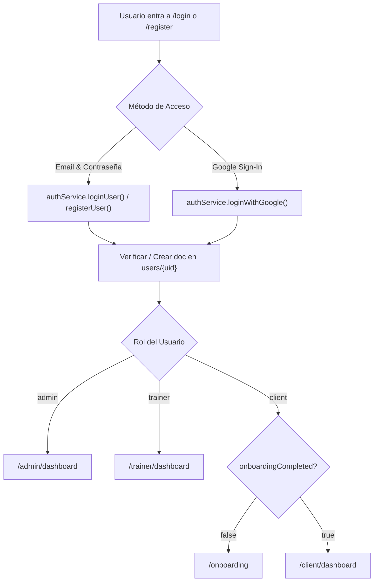

# 🔐 Módulo de Autenticación y Onboarding - CampFit

> **Documento de Arquitectura y Especificación Funcional.**
> Estado: Implementado y Auditado ✅ (2026-08-19).
> Cobertura de Tests: Unitarios + Integración en Vitest.

---

## 1. 📋 Resumen del Módulo

El sistema de autenticación y onboarding de **CampFit** gestiona el ciclo de vida de acceso de usuarios en tres roles:
- **`admin`**: Acceso al panel de administración central (`/admin/dashboard`).
- **`trainer`**: Acceso a la gestión de clientes, dietas, rutinas y correcciones (`/trainer/dashboard`).
- **`client`**: Acceso a la app de entrenamiento, dietas y calendario (`/client/dashboard`). Si no ha completado el onboarding, es guiado a `/onboarding`.

---

## 2. 🔄 Flujo de Autenticación



### 2.1. Métodos de Acceso Soportados
1. **Email / Contraseña:**
   * Validación en cliente con `isValidEmail()`, `isValidPassword()` e indicador visual de fortaleza y requisitos (mayúscula, minúscula, número, longitud).
   * Creación en Firebase Auth y perfil base en Firestore con `role: 'client'`.
2. **Google OAuth (`signInWithPopup`):**
   * Petición de scopes adicionales (`email`, `phone`, `profile`).
   * Decodificación de token para capturar `firstName`, `lastName`, `locale` y `emailVerified`.
   * Creación automática de perfil Firestore para primeros logins con `onboardingCompleted: false`.

### 2.2. Paso de Datos al Onboarding (`sessionStorage Bridge`)
Para evitar que el usuario tenga que escribir dos veces su nombre y datos tras registrarse:
- En `register.astro`: se guarda `registerFormData` en `sessionStorage`.
- En `loginWithGoogle`: se guarda `googleAuthData` en `sessionStorage`.
- En `onboarding.astro`: se consume una sola vez (`removeItem`) para pre-rellenar el formulario automáticamente.

---

## 3. 📝 Proceso de Onboarding (Multi-Paso)

El onboarding consta de **4 pasos guiados** con barra de progreso interactiva:

| Paso | Sección | Campos Recopilados | Validación Requerida |
| :--- | :--- | :--- | :--- |
| **1** | **Información Personal** | Nombre, Fecha de nacimiento, Altura (cm), Peso inicial (kg), Nivel de experiencia, Objetivos | ✅ Sí (Nombre, Nacimiento, Altura, Peso, Experiencia) |
| **2** | **Perfil Médico** | Condiciones médicas, Medicamentos diarios, Alergias, Lesiones previas, Cirugías | ⚪ Opcional (Recomendado) |
| **3** | **Contacto de Emergencia** | Nombre del contacto, Teléfono de emergencia | ✅ Sí (Nombre y Teléfono) |
| **4** | **Restricciones Dietéticas** | Restricciones globales (Sin gluten, sin lactosa, vegano, etc.), otras restricciones, Alimentos excluidos del catálogo | ⚪ Opcional |

### 3.1. Buscador de Alimentos Excluidos
En el Paso 4, el cliente puede buscar alimentos en tiempo real desde la colección de alimentos (`subscribeToFoods()`) para marcarlos como excluidos. Estos IDs (`excludedFoodIds`) se registran en `medicalProfile` y activan alertas preventivas cuando los entrenadores diseñan dietas o rutinas.

---

## 4. 🗄️ Estructura de Datos en Firestore

Documento: `users/{userId}`

```typescript
interface UserDocument {
  name: string;
  email: string;
  role: 'client' | 'trainer' | 'admin';
  photoURL?: string;
  hasActiveAlert: boolean;
  onboardingCompleted: boolean;
  assignedTrainerId?: string;
  createdAt: FieldValue; // serverTimestamp()
  updatedAt: FieldValue; // serverTimestamp()
  
  // Datos clínicos y médicos
  medicalProfile?: {
    birthDate?: string;
    height?: number;
    initialWeight?: number;
    experience?: 'beginner' | 'intermediate' | 'advanced';
    goals?: string[];
    conditions?: string;
    medications?: string;
    allergies?: string;
    injuries?: string;
    surgery?: string;
    emergencyName?: string;
    emergencyPhone?: string;
    dietaryRestrictions?: string[];
    otherDietary?: string;
    excludedFoodIds?: string[];
  };
}
```

---

## 5. 🛡️ Reglas de Seguridad y Anti-Regresión

1. **Evitar escalada de privilegios:**
   * En `firestore.rules`, la regla `allow create` en `/users/{userId}` exige que `request.resource.data.role == 'client'` si el creador es el propio usuario autenticado. Solo un administrador existente puede crear o asignar roles de `trainer` o `admin`.
2. **Bootstrap Admins:**
   * Se preserva el helper `isBootstrapAdminEmail()` para los correos de soporte y control `servicioweb.pmi@gmail.com` y `sevicioweb.pmi@gmail.com`.
3. **Persistencia de idioma limpia:**
   * Navegación interna sin parámetros hardcodeados en URLs (`/login`, `/register`, `/onboarding`, `/client/dashboard`). El idioma persiste de forma transparente vía `localStorage` (`campfit_lang`) y cookie.
4. **Cero diálogos nativos:**
   * Todos los mensajes de error y validación utilizan `showToast`, componentes visuales accesibles y mensajes integrados en el layout.
