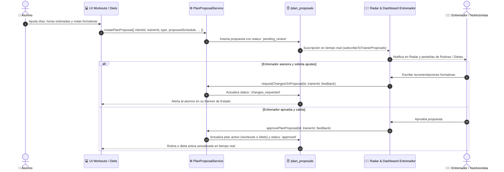

# 🚀 Autonomía de Alumnos y Asesoramiento Formativo de Entrenadores

## 📋 Resumen del Módulo
Este módulo proporciona a los alumnos la capacidad de **autogestionar y personalizar sus rutinas de entrenamiento y planes nutricionales** (distribución de días semanales, horarios programados, adaptaciones de comidas), integrando un **flujo bidireccional y formativo de asesoramiento con su entrenador personal**.

---

## 🏗️ Arquitectura y Flujo de Datos

---

## 🗄️ Modelo de Datos (`PlanProposal`)

Colección Firestore: `/plan_proposals/{proposalId}`

| Campo | Tipo | Descripción |
| :--- | :--- | :--- |
| `id` | `string` | ID único de la propuesta |
| `clientId` | `string` | UID del alumno que propone |
| `clientName` | `string` | Nombre del alumno |
| `trainerId` | `string` | UID del entrenador asignado |
| `type` | `'workout' \| 'diet'` | Tipo de plan |
| `status` | `'pending_review' \| 'approved' \| 'changes_requested'` | Estado de la revisión |
| `proposedSchedule` | `PlanProposalSchedule` | Días semanales y horas programadas |
| `proposedData` | `Record<string, unknown>` | Estructura completa de rutina o dieta propuesta |
| `originalPlanId` | `string?` | ID del plan actual a actualizar tras aprobación |
| `clientNotes` | `string?` | Explicación o dudas del alumno |
| `trainerFeedback` | `string?` | Consejos, advertencias formativas o correcciones del coach |
| `reviewedAt` | `Timestamp?` | Fecha y hora de la revisión |
| `createdAt` | `Timestamp` | Fecha de envío |
| `updatedAt` | `Timestamp` | Última actualización |

---

## 🔒 Reglas de Seguridad Firestore

Configuradas en `firestore.rules`:
- **Read**: Permitido si el usuario autenticado es el alumno propietario (`request.auth.uid == resource.data.clientId`) o el entrenador asignado (`isTrainer() && request.auth.uid == resource.data.trainerId`) o `isStaff()`.
- **Create**: Permitido al alumno para su propio UID (`request.auth.uid == request.resource.data.clientId`).
- **Update**: Permitido al entrenador asignado para asesorar y aprobar (`isTrainer() && request.auth.uid == resource.data.trainerId`) o al alumno para ajustar su propuesta.

---

## 🖥️ Componentes y Vistas Conectadas

1. **Cliente:**
   - `src/pages/client/workouts.astro`: Modal `#customize-workout-modal` con selector de días y hora estimada. Banner `#proposal-status-banner` reactivo.
   - `src/pages/client/diets.astro`: Modal `#customize-diet-modal` para horas de comidas (Desayuno, Almuerzo, Merienda, Cena). Banner `#diet-proposal-status-banner`.
2. **Entrenador:**
   - `src/pages/trainer/dashboard.astro`: Tarjeta `#proposals-radar-card` con contador en vivo de propuestas de alumnos.
   - `src/pages/trainer/workouts.astro`: Pestaña `✨ Propuestas de Alumnos` con asesoramiento y botón `✅ Aprobar y Activar Plan`.
   - `src/pages/trainer/diets.astro`: Pestaña `✨ Propuestas de Alumnos` con distribución de horas de ingesta, feedback y aprobación directa.
