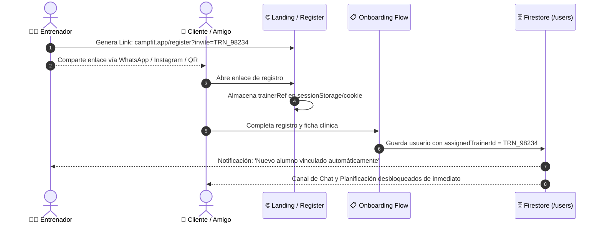
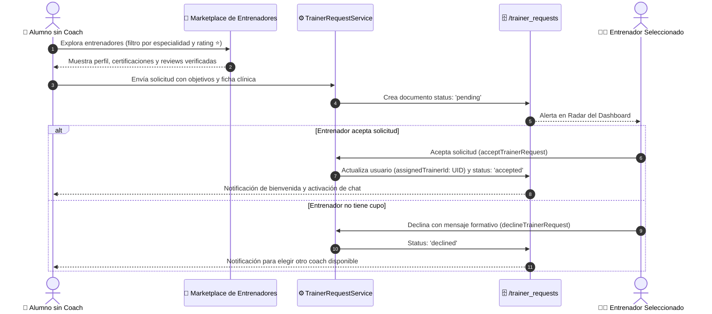

# 🏆 Especificación de Arquitectura: Marketplace, Enlaces de Invitación y Reviews de Entrenadores

> **Documento de Diseño Técnico para Versión Futura (Roadmap)**  
> **Estado:** 📋 Especificado & Aprobado para Desarrollo  
> **Alcance:** Viralidad de captación para entrenadores, Marketplace de búsqueda, Sistema de Reviews Verificadas y Match de Asesoramiento.

---

## 🎯 1. Visión y Objetivos del Módulo

1. **Autonomía y Crecimiento para Entrenadores:** Permitir que los entrenadores inviten a sus propios clientes, amigos o prospectos mediante **links únicos de referidos / QR**, logrando que al registrarse queden vinculados a ellos de forma 100% automática.
2. **Descubrimiento y Match para Alumnos:** Ofrecer a los alumnos que ingresan sin entrenador un **Directorio / Marketplace público** donde buscar entrenadores según su disciplina (fútbol, running, fuerza, pérdida de grasa), ver su biografía, certificaciones y puntuaciones reales.
3. **Reputación y Reviews Verificadas:** Implementar un sistema de calificación por estrellas (⭐ 1 a 5) y testimonios que solo pueden emitir alumnos con más de 14 días de entrenamiento activo con dicho coach (anti-fraude).
4. **Solicitudes de Asesoramiento:** Flujo bidireccional donde el alumno solicita entrenamiento a un coach, y este revisa su ficha clínica/objetivos antes de aceptar la tutela.

---

## 🏗️ 2. Arquitectura de Flujos

### 🔗 Flujo A: Registro por Enlace de Invitación del Entrenador


---

### 🔍 Flujo B: Marketplace, Reviews y Solicitud de Entrenamiento


---

## 🗄️ 3. Modelo de Datos Firestore

### A. Colección `/trainer_invites/{inviteId}`
```typescript
export interface TrainerInvite {
  id: string;                      // Código único (ej: "coach-carlos" o hash alfanumérico)
  trainerId: string;               // UID del entrenador creador
  trainerName: string;
  trainerEmail: string;
  customSlug?: string;             // ej: "carlos-fit" -> campfit.app/join/carlos-fit
  totalUses: number;               // Contador de registros completados
  isActive: boolean;
  createdAt: Timestamp;
  expiresAt?: Timestamp;
}
```

### B. Colección `/trainer_reviews/{reviewId}`
```typescript
export interface TrainerReview {
  id: string;
  trainerId: string;               // UID del entrenador evaluado
  clientId: string;                // UID del alumno autor
  clientName: string;
  rating: number;                  // 1 a 5 estrellas
  aspects: {
    technicalFeedback: number;     // 1 a 5: Calidad de corrección técnica
    chatResponsiveness: number;    // 1 a 5: Rapidez y cercanía en chat
    planCustomization: number;     // 1 a 5: Adaptación de rutinas y comidas
  };
  comment: string;                 // Testimonio del alumno
  verifiedClient: boolean;         // true si entrenó > 14 días con este coach
  isPublic: boolean;
  createdAt: Timestamp;
}
```

### C. Colección `/trainer_requests/{requestId}`
```typescript
export interface TrainerRequest {
  id: string;
  clientId: string;
  clientName: string;
  clientEmail: string;
  trainerId: string;
  status: 'pending' | 'accepted' | 'declined';
  clientGoals: string[];           // ej: ['gain_muscle', 'football_performance']
  athleticFocus?: string;
  message?: string;                // Presentación del alumno
  trainerResponseNote?: string;    // Nota o motivo del entrenador
  createdAt: Timestamp;
  respondedAt?: Timestamp;
}
```

### D. Extensión en `/users/{trainerId}`
```typescript
export interface TrainerPublicProfile {
  isPublicInMarketplace: boolean;  // true para aparecer en directorio
  bio: string;                     // Biografía profesional
  specialties: string[];           // ej: ['Hipertrofia', 'Fútbol', 'Nutrición Deportiva']
  certifications: string[];        // Títulos / Certificados
  maxCapacity: number;             // Límite de alumnos simultáneos
  currentActiveClients: number;    // Clientes activos en tutela
  averageRating: number;           // Promedio calculado de estrellas (ej: 4.9)
  totalReviewsCount: number;       // Número total de reviews
  socialLinks?: {
    instagram?: string;
    website?: string;
  };
}
```

---

## 🛡️ 4. Reglas de Seguridad Firestore (`firestore.rules`)

```javascript
// Invites de entrenadores
match /trainer_invites/{inviteId} {
  allow read: if true; // Lectura pública para validar código al registrarse
  allow create, update, delete: if isTrainer() && request.auth.uid == request.resource.data.trainerId;
}

// Reviews verificadas
match /trainer_reviews/{reviewId} {
  allow read: if true; // Lectura pública para el marketplace
  allow create: if isAuth() 
    && request.auth.uid == request.resource.data.clientId
    && request.resource.data.rating >= 1 
    && request.resource.data.rating <= 5;
  allow update, delete: if isStaff();
}

// Solicitudes de match alumno-entrenador
match /trainer_requests/{requestId} {
  allow read: if isAuth() && (
    request.auth.uid == resource.data.clientId ||
    request.auth.uid == resource.data.trainerId ||
    isStaff()
  );
  allow create: if isAuth() && request.auth.uid == request.resource.data.clientId;
  allow update: if isAuth() && (
    (isTrainer() && request.auth.uid == resource.data.trainerId) ||
    isStaff()
  );
}
```

---

## 📱 5. Pantallas e Interfaces Planificadas

| Ruta | Rol | Propósito |
| :--- | :--- | :--- |
| `/trainer/invites` | Entrenador | Panel de generación de enlaces referidos, QR para imprimir y estadísticas de conversión. |
| `/trainers` | Público / Cliente | Marketplace y buscador de entrenadores con filtros, badges de rating y botón de solicitud. |
| `/trainers/[id]` | Público / Cliente | Perfil público detallado, galería de certificaciones y listado de reviews verificadas. |
| `/trainer/requests` | Entrenador | Bandeja de solicitudes de alumnos entrantes con ficha de objetivos para Aceptar/Declinar. |
| `/client/rate-trainer` | Cliente | Modal o formulario para puntuar y dejar review tras cumplir 14 días de entrenamiento. |

---

## 🚀 6. Fases de Implementación en el Roadmap

- [ ] **Fase 1 (P0): Enlaces de Invitación & Auto-Vinculación**  
  Generador de enlaces en panel entrenador + captura del query param `?invite=` en `onboarding.astro` para autoasignación instantánea.
- [ ] **Fase 2 (P1): Directorio Público y Perfil de Entrenadores**  
  Vista `/trainers` con búsqueda por disciplinas deportivas y ficha de perfil.
- [ ] **Fase 3 (P1): Sistema de Solicitudes (Match)**  
  Integración de solicitudes en el Radar del Dashboard del entrenador con aceptación/rechazo en un clic.
- [ ] **Fase 4 (P2): Sistema de Reviews Verificadas & Métricas**  
  Puntuación de 1 a 5 estrellas con validación de antigüedad mínima y cálculo automatizado de rating medio.
